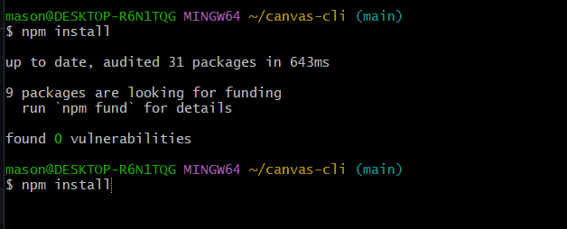

# Canvas Assignment Tracker CLI

A command-line tool that retrieves courses and assignments from Canvas and displays upcoming deadlines in a formatted terminal interface.

## Demo



## Setup

```bash
git clone https://github.com/MasonNelson1/canvas-cli
cd canvas-cli
npm install
```

Create `.env`:

```
CANVAS_API_TOKEN=your_token
CANVAS_BASE_URL=https://boisestatecanvas.instructure.com
```

## Run

```bash
node index.js courses
```

## Example Commands

```bash
node index.js courses
node index.js assignments 12345
```

## API Endpoints Used

| Endpoint | Purpose |
|----------|---------|
| `/api/v1/courses` | Retrieves user courses |
| `/api/v1/courses/:id/assignments` | Lists assignments for a course |

## Reflection

Working on this project provided hands-on experience with REST APIs. I learned how to authenticate with a third-party API using Bearer tokens, construct HTTP requests with axios, and handle errors gracefully when the API is unavailable. Understanding how to read API documentation and map endpoints to application features was an essential skill developed throughout this project.

Managing Canvas API tokens taught me the importance of keeping sensitive credentials out of source control. Using a `.env` file combined with `dotenv` allowed me to load environment variables at runtime without committing secrets to the repository. The `.gitignore` file ensures that neither `.env` nor `node_modules` are accidentally pushed to GitHub.

Parsing JSON responses from the Canvas API required understanding the data structures returned by the server. I used JavaScript array methods like `.filter()` and `.sort()` to process assignment data, extract relevant fields like `due_at`, and present them in a human-readable format. Building a CLI tool with `chalk` for colorized output and `process.argv` for argument parsing made the tool practical and easy to use from the terminal.